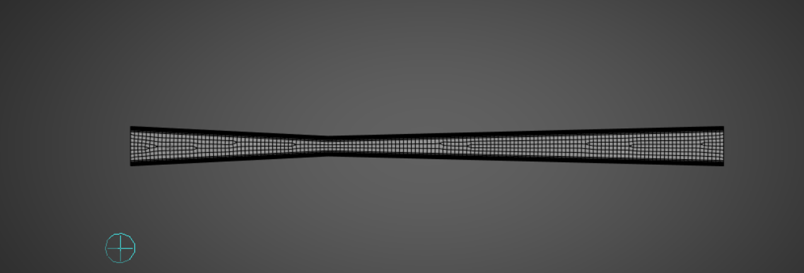

# Computational Analysis of a Converging-Diverging Nozzle

## Overview

A computational fluid dynamics (CFD) study of compressible flow through a two-dimensional converging-diverging nozzle using ANSYS Fluent.

The objective is to investigate the acceleration of compressible flow from subsonic to supersonic conditions and compare the CFD results with analytical isentropic-flow theory.

---

## Objectives

* Model compressible flow through a converging-diverging nozzle.
* Study Mach number, velocity, pressure and temperature variations.
* Investigate choking and sonic conditions at the throat.
* Compare CFD predictions with analytical isentropic-flow calculations.
* Evaluate the agreement between CFD and theoretical results.

---

## Physical Model

The working fluid is air, modeled as an ideal gas.

For steady flow, conservation of mass is expressed as:

```math
\dot{m} = \rho A V = \text{constant}
```

Mach number is defined as:

```math
M = \frac{V}{a}
```

where the local speed of sound is:

```math
a = \sqrt{\gamma R T}
```

The quasi-one-dimensional area-velocity relationship is:

```math
\frac{dA}{A} = (M^2-1)\frac{dV}{V}
```

This explains the acceleration mechanism in a converging-diverging nozzle:

* Subsonic flow accelerates in the converging section.
* The throat approaches `M = 1` under choked conditions.
* Supersonic flow accelerates in the diverging section.

---

## Geometry

The analytical model uses:

* Throat diameter: `20 mm`
* Exit diameter: `30 mm`
* Working fluid: Air
* Specific heat ratio: `γ = 1.4`
* Gas constant: `R = 287 J/(kg·K)`
* Stagnation temperature: `T₀ = 300 K`

### Throat Area

```math
A_t = \frac{\pi D_t^2}{4}
```

```math
A_t = \frac{\pi(0.020)^2}{4}
= 3.1416\times10^{-4}\ \mathrm{m^2}
```

### Exit Area

```math
A_e = \frac{\pi D_e^2}{4}
```

```math
A_e = \frac{\pi(0.030)^2}{4}
= 7.0686\times10^{-4}\ \mathrm{m^2}
```

### Area Ratio

```math
\frac{A_e}{A_t}
=
\frac{7.0686\times10^{-4}}
{3.1416\times10^{-4}}
\approx 2.25
```

---

## Analytical Calculation

### 1. Exit Mach Number

For quasi-one-dimensional isentropic flow:

```math
\frac{A}{A^*}
=
\frac{1}{M}
\left[
\frac{2}{\gamma+1}
\left(
1+\frac{\gamma-1}{2}M^2
\right)
\right]^{\frac{\gamma+1}{2(\gamma-1)}}
```

Using:

```math
\frac{A_e}{A_t}=2.25
```

and solving for the supersonic branch:

```math
M_e \approx 2.20
```

Therefore:

```math
\boxed{M_{e,\mathrm{theory}}\approx2.20}
```

### 2. Exit Static Temperature

For isentropic flow:

```math
\frac{T_0}{T_e}
=
1+\frac{\gamma-1}{2}M_e^2
```

Therefore:

```math
T_e=
\frac{T_0}
{1+\frac{\gamma-1}{2}M_e^2}
```

Substituting:

```math
T_e=
\frac{300}
{1+\frac{0.4}{2}(2.20)^2}
```

```math
\boxed{T_{e,\mathrm{theory}}\approx152.4\ \mathrm{K}}
```

### 3. Exit Speed of Sound

The local speed of sound is:

```math
a_e=\sqrt{\gamma R T_e}
```

```math
a_e=
\sqrt{(1.4)(287)(152.4)}
\approx247.5\ \mathrm{m/s}
```

### 4. Exit Velocity

Since:

```math
M_e=\frac{V_e}{a_e}
```

then:

```math
V_e=M_ea_e
```

```math
V_e=(2.20)(247.5)
```

Therefore:

```math
\boxed{V_{e,\mathrm{theory}}\approx544.5\ \mathrm{m/s}}
```

### 5. Exit Static Pressure

For isentropic flow:

```math
\frac{P_0}{P_e}
=
\left[
1+\frac{\gamma-1}{2}M_e^2
\right]^{\frac{\gamma}{\gamma-1}}
```

Therefore:

```math
\frac{P_e}{P_0}
=
\left[
1+\frac{\gamma-1}{2}M_e^2
\right]^{-\frac{\gamma}{\gamma-1}}
```

Using `Mₑ = 2.20`:

```math
\frac{P_e}{P_0}\approx0.0935
```

Therefore:

```math
\boxed{P_{e,\mathrm{theory}}\approx0.0935P_0}
```

---

## CFD Methodology

The simulation was performed using ANSYS Fluent.

### Solver Setup

* Domain: 2D
* Working fluid: Air
* Density model: Ideal Gas
* Energy equation: Enabled
* Turbulence model: `[Insert actual model]`
* Solver: `[Insert actual solver]`
* Pressure-velocity coupling: `[Insert actual method]`
* Spatial discretization: `[Insert actual schemes]`

### Boundary Conditions

| Boundary | Condition                   |
| -------- | --------------------------- |
| Inlet    | `[Insert actual condition]` |
| Outlet   | `[Insert actual condition]` |
| Walls    | `[Insert actual condition]` |

---

## Mesh

The computational domain was discretized using a numerical mesh.

The mesh was refined sufficiently to capture the flow gradients through the throat and diverging section.



---

## CFD Results

### Mach Number

The Mach number increases through the converging section and reaches a high value in the diverging section.


### Velocity

The velocity increases as the flow accelerates through the nozzle.


### Static Pressure

Static pressure decreases as the flow accelerates.


### Static Temperature

Static temperature decreases as the flow accelerates.


---

## CFD Exit Results

The following values were obtained using an **area-weighted average over the outlet surface** in ANSYS Fluent.

| Parameter               |    CFD Value |
| ----------------------- | -----------: |
| Exit Mach Number        |     1.942941 |
| Exit Velocity           | 504.3203 m/s |
| Exit Static Pressure    |  22152.43 Pa |
| Exit Static Temperature |   171.6138 K |
| Exit Total Temperature  |   299.6936 K |

The CFD total temperature remains close to the specified stagnation temperature of `300 K`.

---

## CFD vs Analytical Theory

| Parameter               | Analytical |          CFD | Difference |
| ----------------------- | ---------: | -----------: | ---------: |
| Exit Mach Number        |       2.20 |     1.942941 |     11.68% |
| Exit Velocity           |  544.5 m/s | 504.3203 m/s |      7.38% |
| Exit Static Temperature |    152.4 K |   171.6138 K |     12.61% |
| Exit Static Pressure    |  0.0935 P₀ |  22152.43 Pa |          — |

The analytical pressure is expressed as a ratio to stagnation pressure because the numerical analytical value of `P₀` has not been specified in the calculation.

Detailed numerical comparison is provided in:

`CD_Nozzle_Theory_vs_CFD.xlsx`

The analytical calculations are documented in:

`CD_Nozzle_Calculations_Analytical.pdf`

---

## Convergence

The residual history was monitored during the simulation to assess convergence.


---

## Engineering Interpretation

The CFD solution demonstrates the expected behaviour of compressible flow through a converging-diverging nozzle.

The flow accelerates through the converging section and reaches a high Mach number near the throat. The flow subsequently accelerates through the diverging section.

The corresponding acceleration is accompanied by reductions in static pressure and static temperature.

The CFD exit Mach number of approximately `1.94` is lower than the ideal isentropic prediction of approximately `2.20`.

The CFD exit velocity and static temperature also differ from the analytical predictions.

The analytical model assumes ideal, quasi-one-dimensional, isentropic flow, whereas the CFD model may include effects associated with viscous losses, boundary layers, numerical discretization, mesh resolution, and non-uniform flow.

---

## Key Findings

* The nozzle accelerates compressible flow from subsonic toward supersonic conditions.
* The CFD outlet Mach number is approximately `1.94`.
* The CFD outlet velocity is approximately `504.3 m/s`.
* The CFD outlet static temperature is approximately `171.6 K`.
* The CFD outlet static pressure is approximately `22.15 kPa`.
* The CFD results were compared quantitatively with ideal isentropic-flow predictions.
* The outlet total temperature is approximately `299.7 K`, close to the specified stagnation temperature of `300 K`.

---
